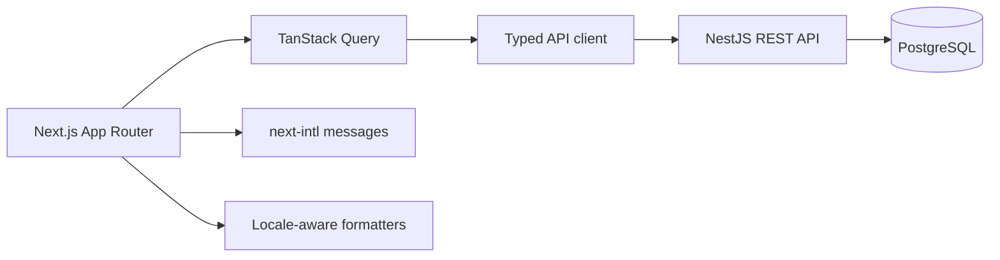

<div align="center">

# Sport Calorie - Personal Fitness and Calorie Tracker

**See today's calories, food, walking, and workouts the moment you open the app, and log the next entry in seconds.**

[](https://nextjs.org/)
[](https://react.dev/)
[](https://www.typescriptlang.org/)
[](https://tailwindcss.com/)
[](https://playwright.dev/)

[Backend repository](https://github.com/bohdanhora/sport-calorie-back)

</div>

## Overview

Sport Calorie is the frontend of a full-stack personal health and fitness application. It answers one question every day: what did I eat, what did I burn, how far did I walk, and am I on track.

The interface is mobile-first, theme-aware, and localized for English, Russian, and Ukrainian. Server data flows through TanStack Query against aggregated endpoints, so each screen is one request rather than a pile of entries the browser has to add up.

## Highlights

- **Today at a glance** - remaining calories as the headline number, consumed against goal and activity, macros, walking totals, meals, workouts, and weight on one screen.
- **Fast logging** - four quick-add actions, bottom sheets on mobile with the primary action pinned within reach, recently used foods, and smart defaults everywhere.
- **Reusable food library** - a card grid of saved and catalog foods with calories and macros on the face of each card; one click opens the portion form already filled in with that food.
- **Walking and treadmill first** - enter any two of duration, distance, and speed, and the third is derived; incline is part of the estimate.
- **Live energy estimates** - the calorie burn updates as the activity form is filled, is labelled as an estimate, and can be replaced with a measured value.
- **Automatic calorie estimation** - describe a dish in words and get a pre-filled draft you confirm before it reaches the diary.
- **Progress and history** - weight trend, calorie and activity charts, walking distance, weekly averages, an activity breakdown, and every logged day one tap away.
- **Calorie goal you control** - estimated BMR and TDEE, a recommendation, and a manual target the system never overwrites.
- **A guided first run** - a short guide and a four-step wizard collect body data, goal, language, and timezone once, then show the calorie target they produce.
- **Sign in with Google** - Google's own button next to the email form, verified server side, linked to an existing account with the same verified address.
- **Three languages** - English, Russian, and Ukrainian, including locale-aware numbers, units, plurals, and dates.
- **Considered visual design** - one accent colour, hairline borders, tabular numerals, purposeful motion, and light and dark themes designed as two palettes rather than one inverted.

## Tech stack

| Area              | Technology                                                      |
| ----------------- | --------------------------------------------------------------- |
| Framework         | Next.js 15 App Router, React 19, TypeScript strict mode         |
| Styling           | Tailwind CSS 4 design tokens, Radix UI primitives, Lucide icons |
| Server state      | TanStack Query                                                  |
| Forms             | React Hook Form, Zod                                            |
| Charts            | Recharts                                                        |
| Localization      | next-intl with ICU plurals                                      |
| Dates and numbers | `Intl`, date-fns                                                |
| Themes            | next-themes                                                     |
| Testing           | Vitest, Testing Library, Playwright                             |

## Architecture



Three rules the code follows:

- **No business logic in components.** Calories, targets, and estimates are computed by the API. The only calculation in the client is the portion preview in the food sheet, and the server recomputes and returns the values it stores.
- **One request per screen.** The dashboard, history, and progress screens each read one aggregated endpoint.
- **One place per concern.** Number and date formatting lives in `lib/format` and nowhere else, so `45 min`, `3.7 km`, and `1,650` look the same on every screen and in every language.

## Screens

| Route                 | Purpose                                                                           |
| --------------------- | --------------------------------------------------------------------------------- |
| `/`                   | Today: calorie balance, macros, walking, meals, activities, weight, quick add     |
| `/food`               | The day's diary and the reusable food library                                     |
| `/activity`           | Walking sessions and workouts for a day                                           |
| `/progress`           | Trends and averages over 7, 30, or 90 days                                        |
| `/history`            | Every logged day, opening into that day                                           |
| `/settings`           | Body data, calorie goal, automatic estimation, language, timezone, theme, account |
| `/login`, `/register` | Session, with email and Google                                                    |

Any screen that shows a single day reads `?date=YYYY-MM-DD`, so a day can be linked to and the browser back button works. History links straight into a day.

## First run

An account that has never answered the wizard opens it over Today, and it cannot be dismissed until it is answered. The guide comes first, then body data, goal and daily activity, and language and timezone. Everything is sent in one `POST /profile/onboarding`, which stores the profile, records the starting weight as a normal weight entry, and stamps `onboardingCompletedAt` so the wizard never returns.

The last step is the payoff rather than another question: the target the API calculated from those answers, with the BMR and TDEE behind it, and a field to override it. The client never calculates any of it. The guide alone can be reopened from Settings.

## Languages

The interface ships in English, Russian, and Ukrainian. The language is a profile setting, so it follows the account to any device, and a cookie mirrors it so the sign-in screen and the first server render already speak the right language.

Everything follows the locale, not only the labels:

- numbers use the locale's separators, so `1,650 kcal` becomes `1 650 ккал` and `3.7 km` becomes `3,7 км`;
- units are translated, including the ones inside composed values such as `1 h 20 min` and `1 год 20 хв`;
- plurals use ICU rules, which matters for Russian and Ukrainian where one, few, and many differ;
- dates and weekday names come from `Intl` in the active locale;
- the activity catalog is translated by slug, so the shared database catalog stays language neutral.

Adding a language takes three steps: add it to `LOCALES` in `src/i18n/config.ts`, add its `Intl` tag, and copy `src/i18n/messages/en.json`.

## Automatic calorie estimation

When a provider is configured in settings, the food sheet gains a field where a dish can be described in words. The estimate fills the same form used for manual entry, is marked as an estimate, and nothing is written to the diary until it is confirmed. Without a configured provider the field is simply not shown.

The API key is entered in settings and stored encrypted on the server. The browser never receives it back, only a mask such as `sk-...4f2a`.

## Design system

The interface is meant to feel like a calm, precise health product rather than a dashboard template.

- One accent colour, a muted green, used for progress and primary actions. Semantic red only for going over the goal.
- A neutral, slightly warm background with hairline borders. Sections are separated by spacing and rules, not by nesting every element in a card.
- Numbers are the content: tabular figures and a deliberate scale from the day's headline metric down to secondary values.
- The calorie bar shows consumed against the full allowance, with a tick marking where the base goal sits when logged activity has extended it, so the model is visible rather than explained.
- Motion is limited and purposeful: content rises 8 px into place over 240 ms with a staggered delay for rows, the headline number counts to its new value when the date changes, progress bars and charts ease into their new size, and buttons compress slightly on press. Everything respects `prefers-reduced-motion`.
- Light and dark themes are designed as two palettes. The theme follows the system by default and can be set explicitly.
- The layout is mobile-first, but it does not stop there: from `xl` the column widens and every screen splits into two, so a wide display shows a day at a glance instead of a narrow ribbon between two empty margins. Today puts the balance, quick add, macros and walking beside the diary; Activity, Settings and Progress pair their sections; History and the food library become card grids. Source order is the reading order, so keyboard and screen reader navigation is unaffected.

**Accessibility.** Semantic landmarks and headings, labelled fields with error text tied to inputs, visible focus rings that are never removed, accessible dialogs and radio groups from Radix, `aria-current` on navigation, and a live region for toasts.

**Responsive.** Mobile first. Below `lg` the navigation is a bottom bar and dialogs open as bottom sheets with the primary action pinned within reach. Above it there is a sidebar and a centred content column. No horizontal page scrolling at any width.

## Getting started

### Prerequisites

- Node.js 20 or newer
- npm
- A running instance of the [Sport Calorie API](https://github.com/bohdanhora/sport-calorie-back)

### Installation

```bash
git clone https://github.com/bohdanhora/sport-calorie.git
cd sport-calorie
npm ci
cp .env.example .env.local
npm run dev
```

On Windows PowerShell, use `Copy-Item .env.example .env.local` instead of `cp`.

Start the backend first:

```bash
cd ../sport-calorie-back
npm ci
cp .env.example .env
npm run db:migrate:deploy
npm run db:seed
npm run dev
```

Open [http://localhost:3000](http://localhost:3000). With `SEED_DEMO_USER=true` the backend creates a demo account with 30 days of history:

```text
email     demo@sport-calorie.local
password  demo12345
```

## Environment variables

| Variable                       | Required | Description                                                                                                            |
| ------------------------------ | :------: | ---------------------------------------------------------------------------------------------------------------------- |
| `NEXT_PUBLIC_API_URL`          |   Yes    | API base URL including the `/api` prefix, without a trailing slash.                                                    |
| `NEXT_PUBLIC_GOOGLE_CLIENT_ID` |    No    | OAuth 2.0 Web client ID. Empty hides the Google button; the same value has to be set as `GOOGLE_CLIENT_ID` on the API. |

Both values are exposed to the browser by design, so no secrets belong in `NEXT_PUBLIC_*` values. A Google client ID is public information; the API is what verifies the token it produces.

To enable Google sign-in, create an OAuth 2.0 Web client in the Google Cloud Console, add the frontend origin (`http://localhost:3000` in development) to its authorized JavaScript origins, and put the client ID in both projects.

## Available scripts

| Command                    | Description                                       |
| -------------------------- | ------------------------------------------------- |
| `npm run dev`              | Start the development server.                     |
| `npm run build`            | Create an optimized production build.             |
| `npm run start`            | Serve the production build.                       |
| `npm run lint`             | Run the ESLint checks.                            |
| `npm run format`           | Format TypeScript, CSS, JSON, and Markdown files. |
| `npm run typecheck`        | Run the TypeScript compiler with no emit.         |
| `npm test`                 | Run the Vitest unit suite.                        |
| `npm run test:e2e`         | Run the Playwright flows.                         |
| `npm run test:e2e:install` | Download the Playwright browser once.             |

## Project structure

```text
sport-calorie/
├── e2e/                  # Playwright flows, desktop and mobile
└── src/
    ├── app/
    │   ├── (app)/        # Authenticated screens inside the app shell
    │   ├── (auth)/       # Sign in and registration
    │   ├── layout.tsx    # Fonts, locale, providers
    │   └── globals.css   # Design tokens, typography, motion
    ├── components/
    │   ├── ui/           # Design system primitives
    │   ├── layout/       # App shell, navigation, date and theme controls
    │   ├── today/        # Calorie, macro, walking, meal, activity blocks
    │   ├── food/         # Food sheet and reusable food form
    │   ├── activity/     # Activity sheet with a live energy estimate
    │   ├── weight/       # Weight sheet
    │   ├── settings/     # Provider configuration
    │   ├── charts/       # Chart wrappers and tooltip
    │   └── states/       # Empty and error states
    ├── i18n/             # Locale config, request resolution, en/ru/uk messages
    ├── lib/
    │   ├── api/          # Typed client, endpoints, API contracts
    │   ├── auth/         # Session provider
    │   ├── query/        # Query client, keys, invalidation
    │   ├── format/       # Units, dates, locale-bound formatters
    │   ├── nutrition/    # Portion preview
    │   ├── validation/   # Shared numeric form rules
    │   └── utils/        # Class name helper
    └── hooks/            # Selected date, animated numbers
```

## Authentication model

Signing in returns a short-lived access token in the response body and sets a rotating refresh token as an httpOnly cookie.

`src/lib/api/client.ts` is the single place that performs requests. It attaches the access token, sends cookies, and on a `401` refreshes once and replays the request. Concurrent requests share a single refresh, so a burst of `401`s produces one refresh rather than five.

The access token is kept in memory only, never in `localStorage`, so a cross-site scripting bug cannot read it out of storage. On page load the app exchanges the cookie for a fresh token; refresh tokens rotate, so each one is used once. When the refresh fails the session is cleared and the user lands on the sign-in screen.

The API types in `src/lib/api/types.ts` mirror the backend DTOs, so a contract change surfaces as a TypeScript error rather than a runtime surprise.

## Timezones

The user's timezone comes from their profile, not from the browser. Every date shown, every "today", and every day boundary is computed in that timezone through `src/lib/format/dates.ts`, which matches how the API assigns entries to a calendar day. Changing the timezone in settings changes what the app calls today.

## Testing

The unit suite covers the logic that would be silently wrong if it broke: number and duration formatting in every locale, distance precision, conversions between what forms collect and what the API stores, timezone-aware day offsets, and the portion preview including the case where a unit conversion would have to be invented.

Playwright drives the real daily flow against a running API and database, on a desktop viewport and a Pixel-sized one: create an account, answer the first-run wizard, log food, log a treadmill session and check the derived average speed, log a repetition workout, record weight, set a manual calorie goal and confirm it survives, move between days, and see the days in history. A second suite covers language: switching before signing in, choosing a language in settings and confirming it survives a reload, and checking that numbers and units follow it. A third walks the first-run wizard: that it refuses to move on without the data the metabolic formula needs, that the answers reach the database and the wizard stays closed afterwards, and that the guide can be reopened from settings.

```bash
npm test
npm run test:e2e:install   # once
npm run test:e2e
npm run build
```

The Playwright suite starts its own dev server on port 3100 with its own build directory (`NEXT_DIST_DIR=.next-e2e`), so it never shares `.next` with a dev server already running - two Next servers writing one build directory leave pages with missing chunks. That origin has to be in the API's `CORS_ORIGINS`. The suite registers a throwaway account per run. Each test works on a different date so the tests do not interfere with each other.

## Deployment

The frontend runs on any platform that supports Next.js. Configure `NEXT_PUBLIC_API_URL` in the hosting provider and make sure that:

1. the backend allows the deployed frontend origin through `CORS_ORIGINS`;
2. the backend sets `COOKIE_DOMAIN` when the two are served from different subdomains;
3. both are served over HTTPS, since the refresh cookie is marked secure in production.

Stop the development server before building: both write to `.next`.

## Related project

The REST API, calorie model, activity science, and persistence live in [sport-calorie-back](https://github.com/bohdanhora/sport-calorie-back).

## Author

Created by [Bohdan Hora](https://github.com/bohdanhora).
